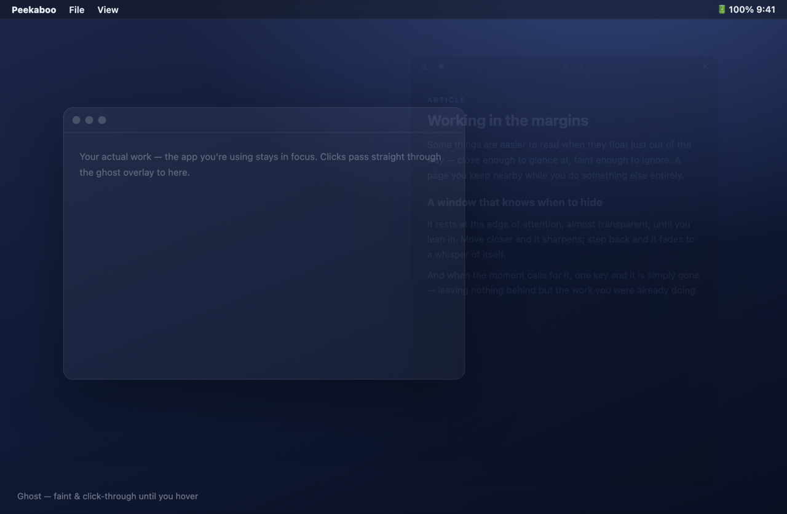
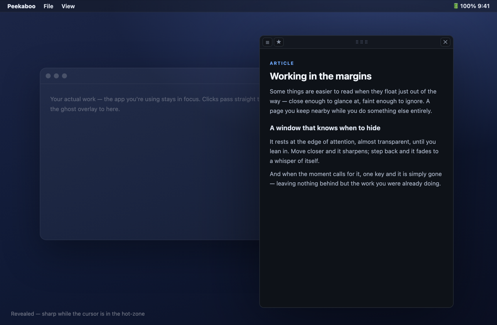
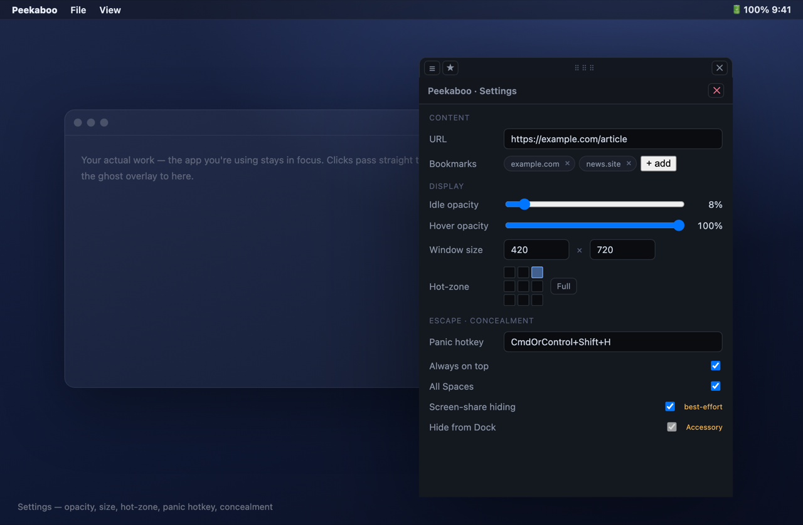
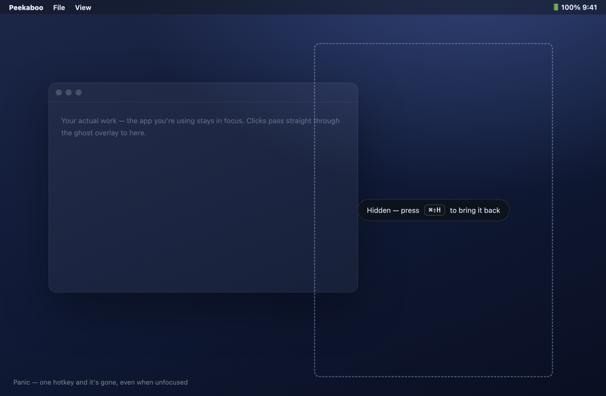

# 🫣 Peekaboo

> 투명하게 항상 위에 떠 있는 macOS 스텔스 브라우저 오버레이 — 마우스를 올릴 때만 또렷해지고, 필요한 순간 즉시 사라진다.

[English](README.md) · **한국어** · [日本語](README.ja.md) · [中文](README.zh.md)

---

> [!NOTE]
> **상태: v0.1.0 — macOS용 구현 완료.** 앱이 빌드되고 단위 테스트를 통과합니다. `npm run tauri build`로 직접 빌드하세요([BUILD.md](BUILD.md) 참고). 실제 스텔스 동작(화면공유 비노출·전역 패닉·클릭 통과·은폐)은 본인 Mac에서 수동 검증하며, 절차는 [BUILD.md](BUILD.md)·[PLAN.md](PLAN.md)에 있습니다.

## Peekaboo란?

Peekaboo는 임의의 웹 페이지를 투명하고 크기 조절이 되는 창으로, 무엇을 하고 있든 그 위에 띄웁니다. 기본 **고스트(ghost)** 상태에서는 거의 보이지 않고, 클릭은 그대로 아래 앱으로 통과됩니다. 커서를 핫존(hot-zone)에 올리면 콘텐츠가 또렷해지고, **전역 단축키를 누르면 흔적 없이 즉시 사라집니다.**

제품 전체가 한 줄로 요약됩니다 — **"보고 싶을 때만 보이고, 필요한 순간 즉시 사라진다."**

## 기능

| | 기능 | 설명 |
|:--:|---|---|
| 👻 | **고스트 오버레이** | 모든 것 위에 떠 있는 투명·무테·항상 위 창 |
| 🫥 | **Hover-Reveal** | 평소엔 저투명 + 클릭 통과, 커서가 핫존에 들어오면 또렷해짐 |
| 🚨 | **패닉 단축키** | 전역 단축키 한 번으로 즉시 숨김 — 포커스가 없어도 동작 |
| 🙈 | **앱 은폐** | Dock·Cmd-Tab·메뉴바에서 숨김 (Accessory 앱) |
| 🎚️ | **투명도 조절** | 평소/호버 불투명도를 따로 설정 |
| 🖥️ | **화면공유 비노출** | best-effort — 아래 솔직한 한계 참고 |

## 사용법

> 아래 이미지는 Peekaboo의 실제 인터페이스(앱 자체 HTML/CSS)로 만든 **UI 렌더**입니다. 실제 스크린샷으로 교체하려면 macOS에서 캡처하세요 — content protection이 macOS 14 이하에서 창을 스크린샷에서 제외할 수 있으니, 설정에서 **화면공유 비노출**을 먼저 잠시 끄세요.

**1 · 페이지 띄우기.** Peekaboo를 실행하면 흐릿한 항상-위 **고스트** 오버레이로 뜹니다. 평소 투명도에서는 거의 보이지 않고, 클릭은 그대로 아래 앱으로 통과됩니다.

**2 · 호버로 노출.** 커서를 오버레이의 핫존에 올리면 콘텐츠가 또렷하게(풀 불투명) 드러납니다. 벗어나면 다시 고스트로 흐려집니다.

**3 · 설정.** ☰ 버튼으로 설정을 엽니다 — URL·북마크, 평소/호버 투명도, 창 크기, 3×3 핫존, 패닉 단축키, 은폐 토글을 조절합니다.

**4 · 사라지기.** 패닉 단축키(기본 ⌘⇧H) 또는 ✕ 버튼을 누르면, 다른 앱이 포커스를 가진 상태에서도 창이 즉시 사라집니다. 다시 누르면 보던 그 위치로 복귀합니다.

## 동작 방식

책임이 명확히 갈리는 Tauri v2 앱입니다. **스텔스의 본체는 모두 Rust 코어가 소유**합니다 — 창 투명·항상 위·클릭 통과·전역 패닉 단축키·호버 감지를 위한 커서 폴링·노출/패닉 상태 머신. **WebView는 표현만** 담당합니다(웹 콘텐츠 렌더와 설정 UI).

어려운 부분은 UI가 아니라 macOS 창 제어입니다. 오버레이가 클릭 통과 상태이면 일반 DOM·네이티브 호버 이벤트가 발생하지 않으므로, hover-reveal은 전역 커서 좌표를 핫존 사각형과 비교하는 폴링으로 구현합니다.

## ⚠️ 솔직한 한계: 화면 공유

macOS content protection을 통한 화면 공유 비노출은 **macOS 15(Sequoia) 이상에서 동작하지 않습니다.** Zoom·Meet·QuickTime가 사용하는 ScreenCaptureKit가 합성된 프레임버퍼를 캡처하며 `NSWindowSharingNone` 플래그를 무시하기 때문입니다([Tauri #14200](https://github.com/tauri-apps/tauri/issues/14200), 알려진 우회 없음). 구버전 macOS(≤ 14)와 구형 스크린샷 API에서만 유효합니다.

따라서 화면 공유 비노출은 **보조 수단(best-effort)** 으로만 두고, **화면 공유 상황의 실질적 방어선은 패닉 단축키**(공유 전에 또는 즉시 숨기기)입니다.

## 문서

전체 기획·설계 문서는 [`docs/`](docs/)에 있습니다 — SVG/HTML 목업이 포함된 다크 테마 6종 세트:

1. [개요](docs/index.html) — 비전, 위협→방어 모델, 핵심 결정
2. [기능 명세](docs/feature-spec.html) — 우선순위별 기능 + 검증된 Tauri API
3. [화면 설계](docs/screen-design.html) — **시각 목업**: 데스크톱 3상태, 오버레이 해부도, 설정 패널
4. [아키텍처·동작](docs/architecture.html) — 프로세스 모델, 상태 머신, 호버 감지 설계
5. [기술스택·구조](docs/tech-stack.html) — 설정, 권한, 코드 골격, 빌드
6. [로드맵](docs/roadmap.html) — 페이즈, 검증 게이트, 리스크 레지스터

> 문서는 HTML입니다. `open docs/index.html`로 로컬에서 열거나, GitHub Pages를 켜서 온라인으로 볼 수 있습니다.

## 기술 스택

- **프레임워크:** Tauri v2 (Rust 코어 + 시스템 WebView)
- **타깃:** macOS 단독
- **프론트엔드:** TypeScript + Vite
- **핵심 플러그인:** `global-shortcut` (패닉 단축키)

## 상태 · 로드맵

**v0.1.0 — 구현 완료.** Phase 0–4 완료: 스캐폴딩 → MVP(오버레이 + 패닉) → 스텔스 본체(hover-reveal) → 은폐 → 설정·영속화·배포. 자동 게이트(빌드·clippy·eslint·tsc·단위 테스트)는 모두 통과했고, 실제 스텔스 동작은 사용자 머신에서 수동 검증합니다. [로드맵](docs/roadmap.html)·[PLAN.md](PLAN.md) 참고.

---

개인용 도구입니다. 책임감 있게 사용하세요. 🫣
